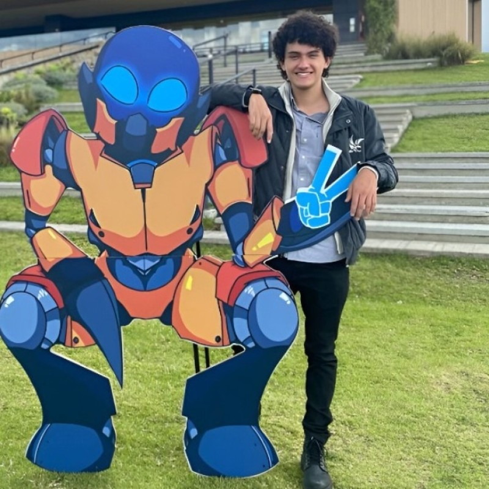
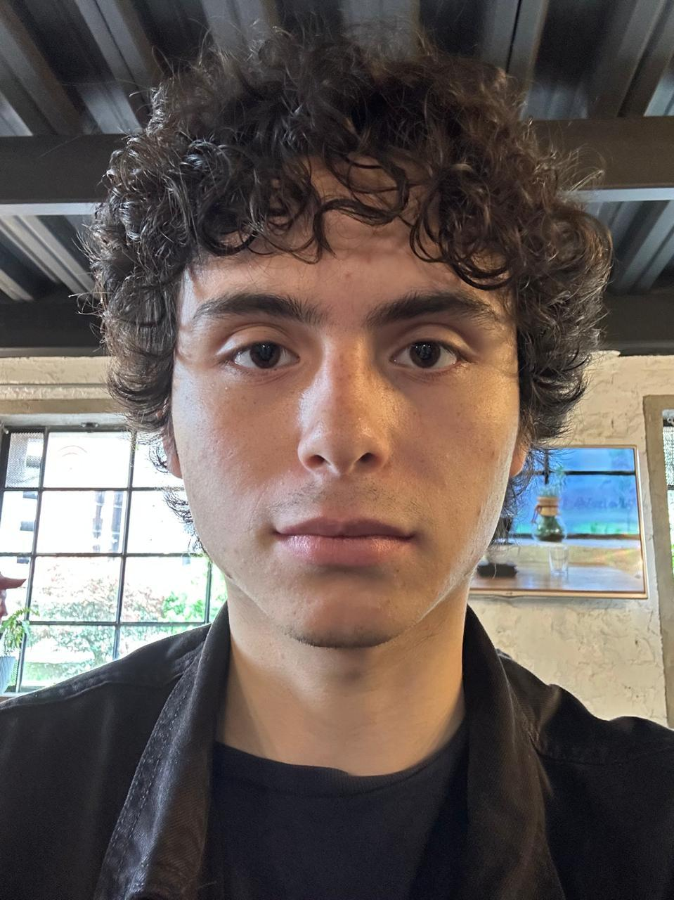

# 🍣 MAKI – Aplicativo Web para Restaurante Japonés

**MAKI** es una aplicación web diseñada para digitalizar la gestión integral de un restaurante japonés. Permite a los clientes realizar pedidos de forma intuitiva y al personal gestionar la operación del restaurante de manera eficiente.

Este proyecto fue desarrollado como parte de la asignatura **Desarrollo Web** en la **Pontificia Universidad Javeriana – Sede Bogotá**.
---

## Descripción del Proyecto

El objetivo principal de **MAKI** es modernizar la experiencia del cliente y mejorar la logística interna de un restaurante, reemplazando procesos manuales —como la toma de pedidos por teléfono o en papel— por una solución digital centralizada.

La aplicación permite gestionar el menú, visualizar productos, organizar pedidos y mejorar la interacción entre clientes y el restaurante.

---

## Objetivos del Sistema

- Digitalizar el proceso de **pedido de alimentos**.
- Ofrecer una **interfaz clara e intuitiva** para los clientes.
- Facilitar la **gestión del menú** por parte del restaurante.
- Optimizar la **organización y administración de pedidos**.
- Proveer una base **escalable y mantenible** para futuras mejoras.

---

## ⚙️ Funcionalidades Principales

- Visualización del **menú del restaurante**.
- Organización de productos por **categorías**.
- Visualización detallada de cada producto.
- **Creación y gestión de pedidos**.
- Administración eficiente de pedidos dentro del sistema.

---

## 👥 Integrantes del Grupo

<table>
<tr>

<td align="center">
 
<strong>Miguel Francisco Vargas Contreras</strong>
</td>

<td align="center">
 
<strong>Tomás Alejandro Silva Correal</strong>
</td>

<td align="center">
 
<strong>Alexander Aponte Largacha</strong>
</td>

<td align="center">
 
<strong>Juan Guillermo Pabón Vargas</strong>
</td>

</tr>
</table>
Este proyecto fue desarrollado con fines meramente académicos.
