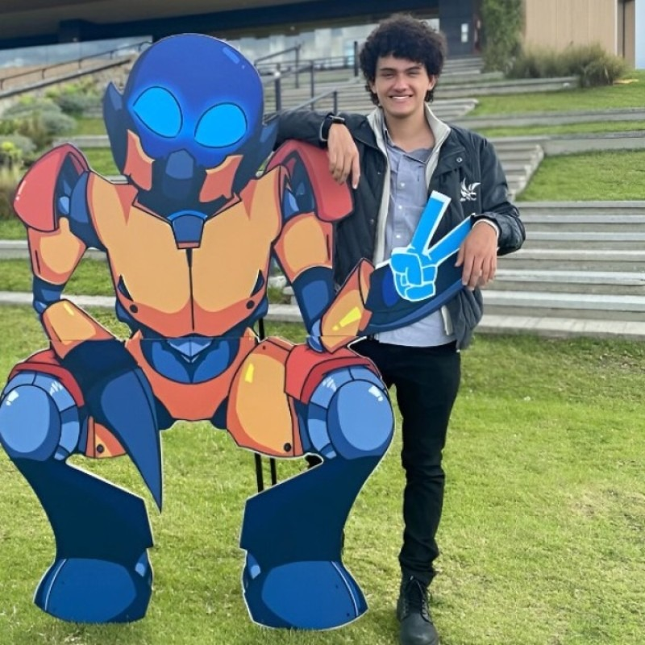

# 🍣 MAKI – Aplicativo Web para Restaurante Japonés

  
  
⚡ Digitalizando la experiencia gastronómica japonesa ⚡

---

**MAKI** es una aplicación web diseñada para digitalizar la gestión integral de un restaurante japonés. Permite a los clientes realizar pedidos de forma intuitiva y al personal gestionar la operación del restaurante de manera eficiente.

🎓 **Desarrollado en** la asignatura _Desarrollo Web_ — Pontificia Universidad Javeriana, Sede Bogotá

---

## 📖 Descripción del Proyecto

  
  
  

El objetivo principal de **MAKI** es modernizar la experiencia del cliente y mejorar la logística interna de un restaurante, reemplazando procesos manuales —como la toma de pedidos por teléfono o en papel— por una solución digital centralizada.

La aplicación permite gestionar el menú, visualizar productos, organizar pedidos y mejorar la interacción entre clientes y el restaurante.

---

## 🎯 Objetivos del Sistema

| 💻 **Digitalización** | 🎨 **Interfaz Intuitiva** | 📋 **Gestión del Menú**         | ⚙️ **Organización de Pedidos** | 🚀 **Escalabilidad**     |
| --------------------- | ------------------------- | ------------------------------- | ------------------------------ | ------------------------ |
| ✅ Proceso de pedido  | ✅ UX clara y moderna     | ✅ Administración fácil         | ✅ Organización eficiente      | ✅ Base para mejoras     |
| 📱 Sin papel          | ✅ Navegación simple      | ✅ Actualización en tiempo real | ✅ Control centralizado        | ✅ Arquitectura flexible |
| 💳 Rapidez            | ✅ Diseño responsive      | ✅ Categorización automática    | ✅ Historial completo          | ✅ Código mantenible     |

---

## ⚙️ Funcionalidades Principales

### 🍱 Menú Digital Interactivo

- Visualización atractiva del menú del restaurante
- Organización inteligente de productos por categorías
- Imágenes de alta calidad y descripciones detalladas

### 📝 Gestión de Pedidos

- Creación rápida y sencilla de pedidos
- Administración eficiente en tiempo real
- Control completo del estado de cada pedido

### 👨‍💻 Panel de Administración

- Interfaz intuitiva para el personal
- Estadísticas y reportes en tiempo real

---

## 🎨 Características Visuales

  
Diseño moderno con enfoque en la experiencia de usuario

- ✅ **Diseño Responsive** – Funciona en todos los dispositivos
- ✅ **Interfaz Intuitiva** – Fácil de usar para clientes y personal
- ✅ **Experiencia Fluida** – Transiciones suaves y rápida respuesta

---

## 👥 Integrantes del Grupo

<table>
<tr>

<td align="center">
  
   
  <a href="#" style="color: #FF6B6B; text-decoration: none; font-size: 12px;">👤</a> 
  <strong style="color: #333;">Miguel Francisco Vargas Contreras</strong>
</td>

<td align="center">
  
   
  <a href="#" style="color: #4ECDC4; text-decoration: none; font-size: 12px;">👤</a> 
  <strong style="color: #333;">Tomás Alejandro Silva Correal</strong>
</td>

<td align="center">
  
   
  <a href="#" style="color: #45B7D1; text-decoration: none; font-size: 12px;">👤</a> 
  <strong style="color: #333;">Alexander Aponte Largacha</strong>
</td>

<td align="center">
  
   
  <a href="#" style="color: #96CEB4; text-decoration: none; font-size: 12px;">👤</a> 
  <strong style="color: #333;">Juan Guillermo Pabón Vargas</strong>
</td>

</tr>
</table>

  
  
📚 Este proyecto fue desarrollado con fines meramente académicos.

---

  
🍣 <strong>MAKI</strong> — Making your dining experience better 🍣

---

  

    <a href="#" style="color: #888;">⭐ Dar estrella</a> · 
    <a href="#" style="color: #888;">📝 Reportar problema</a> · 
    <a href="#" style="color: #888;">📧 Contacto</a>
  

---

---

## Descripción del Proyecto

El objetivo principal de **MAKI** es modernizar la experiencia del cliente y mejorar la logística interna de un restaurante, reemplazando procesos manuales —como la toma de pedidos por teléfono o en papel— por una solución digital centralizada.

La aplicación permite gestionar el menú, visualizar productos, organizar pedidos y mejorar la interacción entre clientes y el restaurante.

---

## Objetivos del Sistema

- Digitalizar el proceso de **pedido de alimentos**.
- Ofrecer una **interfaz clara e intuitiva** para los clientes.
- Facilitar la **gestión del menú** por parte del restaurante.
- Optimizar la **organización y administración de pedidos**.
- Proveer una base **escalable y mantenible** para futuras mejoras.

---

## ⚙️ Funcionalidades Principales

- Visualización del **menú del restaurante**.
- Organización de productos por **categorías**.
- Visualización detallada de cada producto.
- **Creación y gestión de pedidos**.
- Administración eficiente de pedidos dentro del sistema.

---

## 👥 Integrantes del Grupo

<table>
<tr>

<td align="center">
 
<strong>Miguel Francisco Vargas Contreras</strong>
</td>

<td align="center">
 
<strong>Tomás Alejandro Silva Correal</strong>
</td>

<td align="center">
 
<strong>Alexander Aponte Largacha</strong>
</td>

<td align="center">
 
<strong>Juan Guillermo Pabón Vargas</strong>
</td>

</tr>
</table>
Este proyecto fue desarrollado con fines meramente académicos.
